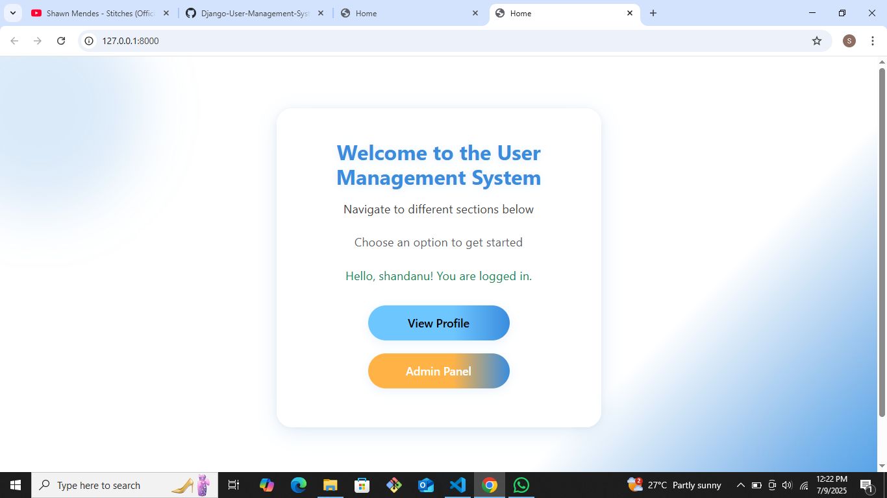

# Django User Management System

A simple Django-based user management system featuring user registration, email verification (mocked), profile management, password change, and admin panel functionalities.

---

## Project Description

This project provides a clean and scalable user management system built with Django. It supports user registration with email verification (mocked via console), profile viewing and editing, password management, and an admin panel for managing all users. The system distinguishes between normal users and admin users with appropriate access controls, and uses Bootstrap for a responsive, user-friendly interface.

---

## Features

-  User Registration & Login with email verification (mocked)
-  Support for user types: Normal User and Admin
-  Profile Management (View, Edit, Change Password)
-  Admin Panel to view and edit all users and profiles
-  Access control: Normal users can only manage their own profiles
-  Responsive UI styled with Bootstrap 5
-  Dark mode support
-  Unit tests covering models and views

---

## Folder Structure
```
user_management/
├── accounts/
│   ├── templates/
│   │   └── accounts/
│   ├── views.py
│   ├── models.py
├── templates/
│   └── base.html
├── static/ (optional)
├── manage.py
```

---

## Prerequisites

- Python 
- Django 
- pip
- Virtual environment tool (recommended)

---

### Installation & Setup 
1. Clone the repository
```
git clone https://github.com/Zambagarrah/Django-User-Management-System.git
cd Django-User-Management-System
```

2. Create virtual environment & install requirements
```
python -m venv env
source env/bin/activate # On Windows: env\Scripts\activate
pip install django
```

3. Run migrations
```
python manage.py makemigrations
python manage.py migrate
```

4. Create a superuser (admin account) 
``` python manage.py createsuperuser ```

5. Launch the server
``` python manage.py runserver ```

- Visit the app in your browser: 🔗 http://127.0.0.1:8000/
- Admin panel: http://127.0.0.1:8000/admin/


## Usage

- Register a new user via the registration page.
- The system sends a mock verification email printed to the console with a verification link.
- Click the verification link to activate your account.
- Log in with your credentials.
- View and edit your profile.
- Change your password.
- Admin users can manage all users and profiles via the Django admin panel.

---

## Email Verification (Mock)

This project uses Django's console email backend for development. Verification emails are printed to the console where you can find the activation link to verify your account.

---

## Testing

Run unit tests with:
```python manage.py test```

Tests cover models and views to ensure correctness and stability.

---

## Screenshots

### Home Page



### Registration Page


### Login Page


### Profile Page


### Admin Panel


---

## Git Workflow

- The project development was done with a maximum of 10 commits.
- Each commit has a clear title and detailed message explaining the changes.

---

### Contact

- Email: [marvinbernard2018@gmail.com](mailto:marvinbernard2018@gmail.com)
- GitHub: [https://github.com/Mavoochie](https://github.com/Mavoochie)

Feel free to reach out for collaborations, freelance projects, or tech discussions!
